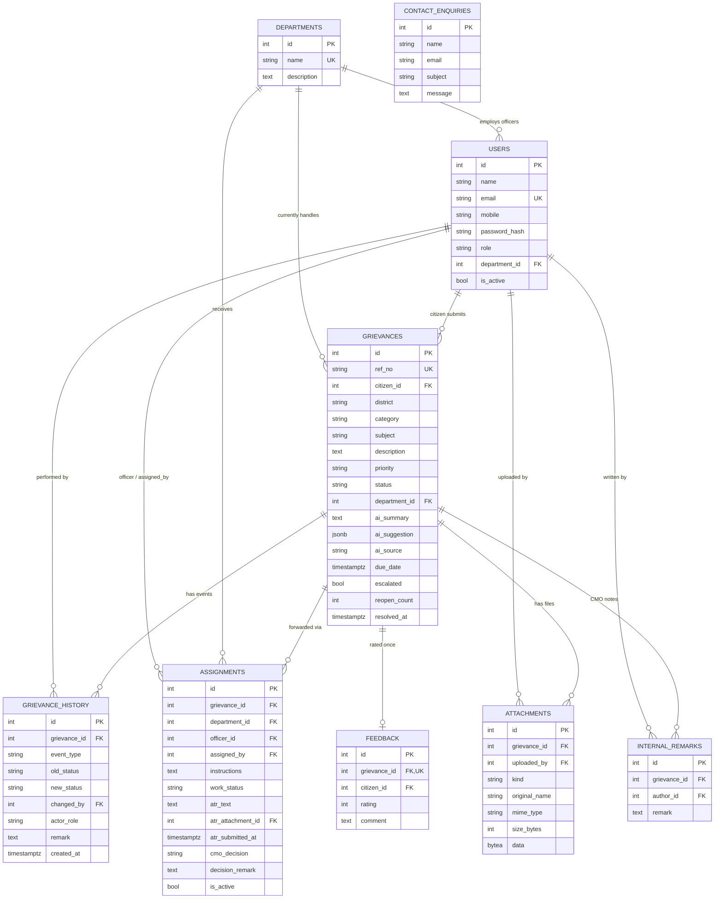

# Database ER diagram

```mermaid
erDiagram
  DEPARTMENTS ||--o{ USERS : "employs officers"
  USERS ||--o{ GRIEVANCES : "citizen submits"
  DEPARTMENTS ||--o{ GRIEVANCES : "currently handles"
  GRIEVANCES ||--o{ GRIEVANCE_HISTORY : "has events"
  USERS ||--o{ GRIEVANCE_HISTORY : "performed by"
  GRIEVANCES ||--o{ ASSIGNMENTS : "forwarded via"
  DEPARTMENTS ||--o{ ASSIGNMENTS : "receives"
  USERS ||--o{ ASSIGNMENTS : "officer / assigned_by"
  GRIEVANCES ||--o{ ATTACHMENTS : "has files"
  USERS ||--o{ ATTACHMENTS : "uploaded by"
  GRIEVANCES ||--o| FEEDBACK : "rated once"
  GRIEVANCES ||--o{ INTERNAL_REMARKS : "CMO notes"
  USERS ||--o{ INTERNAL_REMARKS : "written by"

  DEPARTMENTS { int id PK  string name UK  text description }
  USERS { int id PK  string name  string email UK  string mobile  string password_hash  string role  int department_id FK  bool is_active }
  GRIEVANCES { int id PK  string ref_no UK  int citizen_id FK  string district  string category  string subject  text description  string priority  string status  int department_id FK  text ai_summary  jsonb ai_suggestion  string ai_source  timestamptz due_date  bool escalated  int reopen_count  timestamptz resolved_at }
  GRIEVANCE_HISTORY { int id PK  int grievance_id FK  string event_type  string old_status  string new_status  int changed_by FK  string actor_role  text remark  timestamptz created_at }
  ASSIGNMENTS { int id PK  int grievance_id FK  int department_id FK  int officer_id FK  int assigned_by FK  text instructions  string work_status  text atr_text  int atr_attachment_id FK  timestamptz atr_submitted_at  string cmo_decision  text decision_remark  bool is_active }
  ATTACHMENTS { int id PK  int grievance_id FK  int uploaded_by FK  string kind  string original_name  string mime_type  int size_bytes  bytea data }
  FEEDBACK { int id PK  int grievance_id FK,UK  int citizen_id FK  int rating  text comment }
  INTERNAL_REMARKS { int id PK  int grievance_id FK  int author_id FK  text remark }
  CONTACT_ENQUIRIES { int id PK  string name  string email  string subject  text message }
```

Rendered automatically by GitHub. Source text for the diagram is also embedded in `03_Database_Design.md`.
