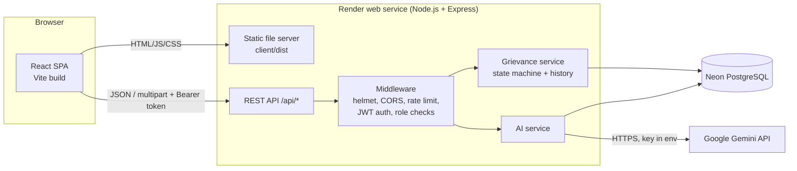

# System architecture diagram

```mermaid
flowchart LR
  subgraph Browser
    UI[React SPA<br/>Vite build]
  end
  subgraph "Render web service (Node.js + Express)"
    STATIC[Static file server<br/>client/dist]
    API[REST API /api/*]
    MW[Middleware<br/>helmet, CORS, rate limit,<br/>JWT auth, role checks]
    SVC[Grievance service<br/>state machine + history]
    AI[AI service]
    API --> MW --> SVC
    MW --> AI
  end
  DB[(Neon PostgreSQL)]
  GEM[Google Gemini API]
  UI -->|HTML/JS/CSS| STATIC
  UI -->|JSON / multipart + Bearer token| API
  SVC --> DB
  AI -->|HTTPS, key in env| GEM
  AI --> DB
```

Rendered automatically by GitHub. Source text for the diagram is also embedded in `02_System_Architecture.md`.
